# Microsoft Cognitive Services を利用した 画像識別アプリ 開発 (201908 版: ヨガポーズ判定(Yoga Pose Classification))

"人工知能 API" [Microsoft Azure Cognitive Services](https://www.microsoft.com/cognitive-services/) を使うと、画像分析を行うエンジンをノーコーディングで利用、作成できます。

[Custom Vision Service](https://azure.microsoft.com/ja-jp/services/cognitive-services/custom-vision-service/) は、ご自分で用意した画像をアップロードしてタグ付け、学習させることで、画像の分類 (Classification) や 画像に写っているモノの抽出 (Object Detection) を行うエンジンを簡単に作成でき、Web API として利用できます。また TensorFlow / CoreML / ONNX、または Docker コンテナー向けに Export して利用することもできます。

ここでは、Custom Vision で画像識別エンジンを作成し、Web アプリ (C# または HTML&JavaScript) からアクセスして利用する方法を紹介します。

> アプリの動作は、[オンラインアプリサンプル](http://cogservicesvisionsamples201906.azurewebsites.net/CustomVisionClassification-Yoga) でご確認ください。

## 目次

0. [準備](#準備)
1. [Custom Vision で画像識別エンジンを作成](#1-custom-vision-で画像識別エンジンを作成)
2. Web アプリから Custom Vision にアクセス
    - [HTML&JavaScript 版](#htmljavascript-版)
    - [C# 版](#c-版)


## 準備

- Azure サブスクリプション & Custom Vision のサービス申込
    - Azure サブスクリプション の申し込みには マイクロソフトアカウントが必要です。
    - [Azure 無償サブスクリプション準備](https://qiita.com/annie/items/3c9ddc3fb8f120769239) の手順で、Azure サブスクリプションと Custom Vision のサブスクリプション申込を行います(無償以外の有償アカウント等でも問題ありません)。

- [CogServicesVisionSamples_201906](https://github.com/ayako/CogServicesVisionSamples_201906) のディレクトリをローカルにダウンロードしておきます。**[Clone or download]** をクリックして、ZIP でダウンロードできます。


## 手順

### 1. Custom Vision で画像識別エンジンを作成

ブラウザーから [Custom Vision のポータル (https://www.customvision.ai)](https://www.customvision.ai) にアクセスします。
**[SIGN IN]** をクリックし、Azure & Custom Vision の サブスクリプションが紐づいたアカウントでサインインします。

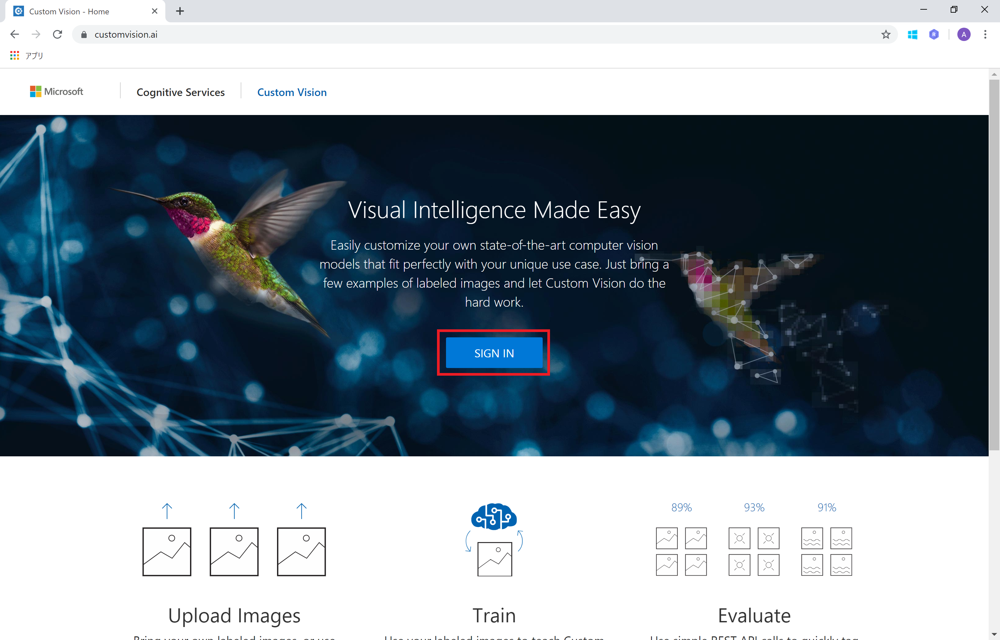

**[NEW PROJECT]** をクリックし、画像識別エンジンを新規に作成するダイアログを開きます。

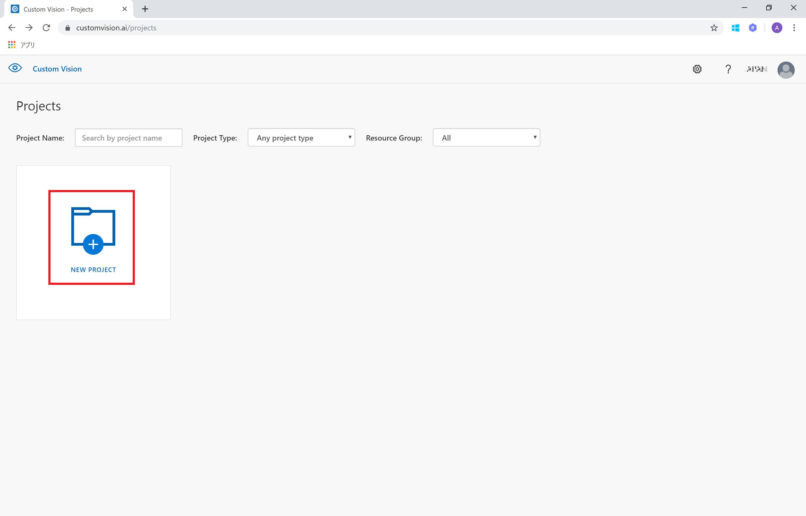

**Create New Project** ダイアログで、**Name** にお好きな名前を入力します。Project Type は **Classification** を選択し、Classification は **Multiclass**　を選択します。**[Create Project]** をクリックして、新規プロジェクトを作成します。

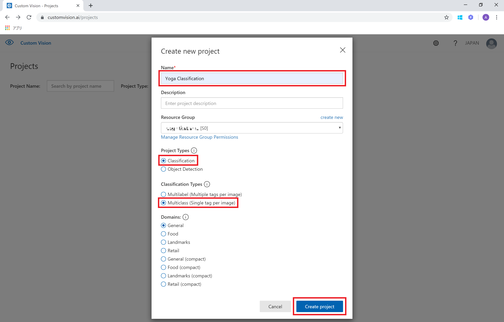

プロジェクトが作成されると詳細画面が表示されます。 **Add Images**　をクリックして、画像識別エンジンに学習させる画像をアップロードするダイアログを開きます。

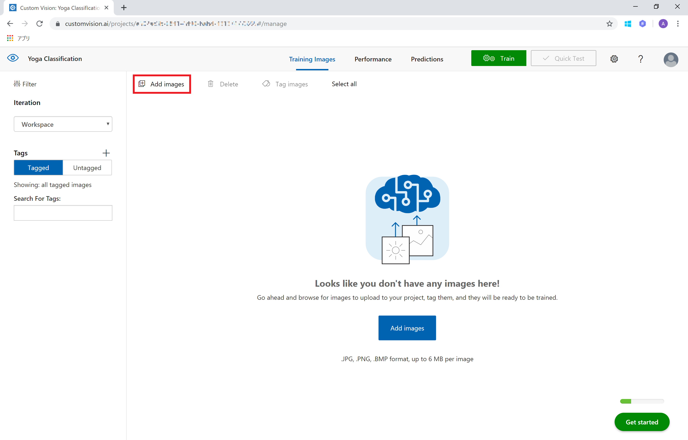

ダウンロードしたコンテンツの [training_images\Yoga](training_images\Yoga) フォルダーにある画像を選択します。まずは bow01~bow06 を選択して **[開く]** をクリックします。

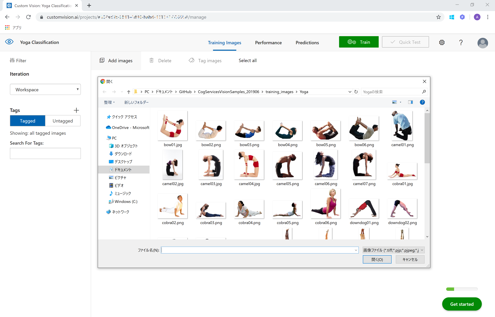

**My Tags** に **弓のポーズ** と入力し、**[Upload Files]** をクリックします。

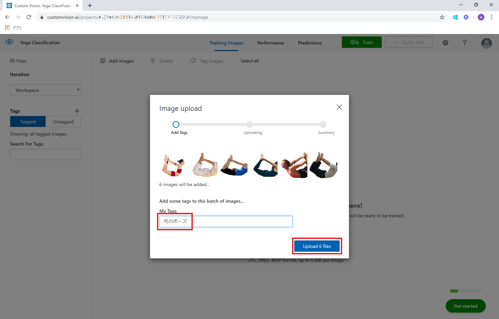

これで *弓のポーズ* のタグが付いた画像がアップロードできました。**[Done]** をクリックしてダイアログを閉じます。

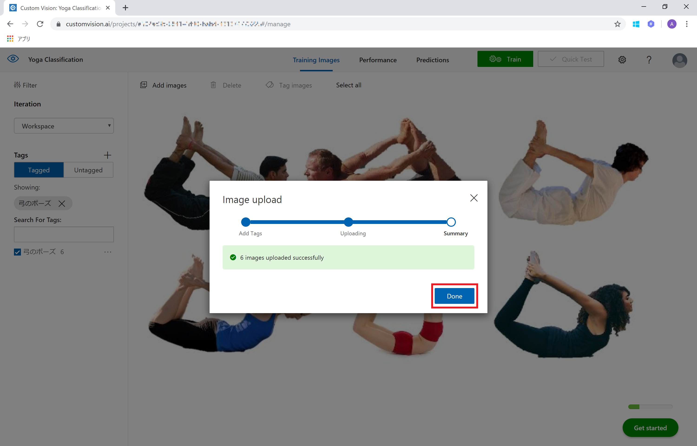

同様に、他の画像もタグをつけてアップロードします。

| 画像ファイル名 | タグ (ヨガポーズの名称) |
|:------------|:---------------------|
| bow | 弓のポーズ |
| camel | ラクダのポーズ |
| cobra | コブラのポーズ |
| downdog | 下向きの犬のポーズ |
| headstand | 頭倒立のポーズ |
| plough | 鋤(すき)のポーズ |
| tree | 木のポーズ |
| triangle | 三角のポーズ |
| warrior | 戦士のポーズ |

画像のアップロードが終了したら、上部バーの **Train** をクリックして、画像をエンジンに学習させます。

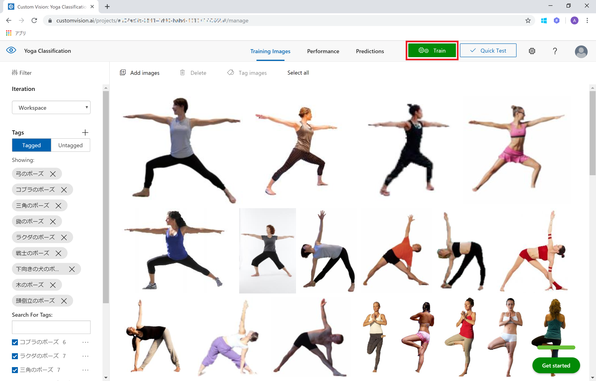

**Training Type** は **Fast Training** を選択し、**Train** をクリックして学習させます。

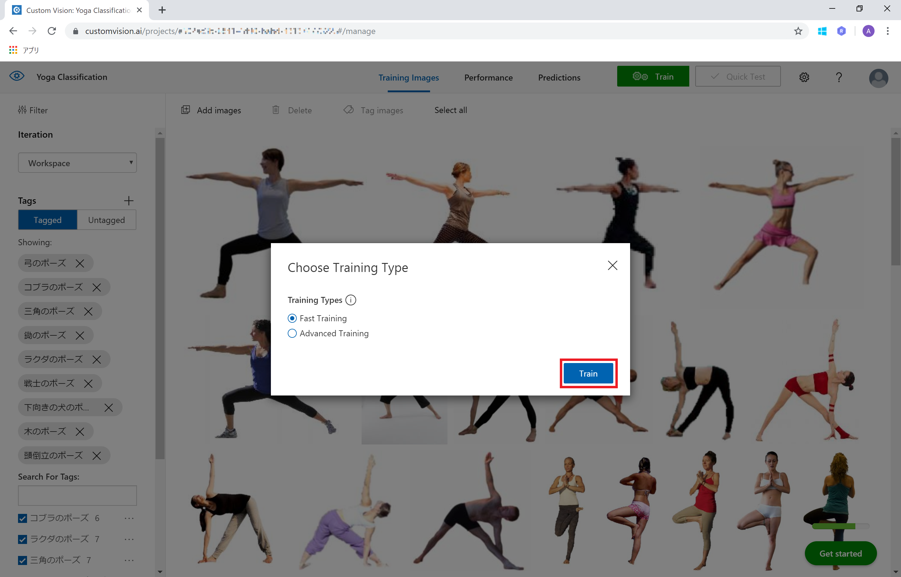

学習が終了すると、**Performance** のページに学習結果が表示されます。このエンジンをテストするには、上部バーから **Quick Test** をクリックします。

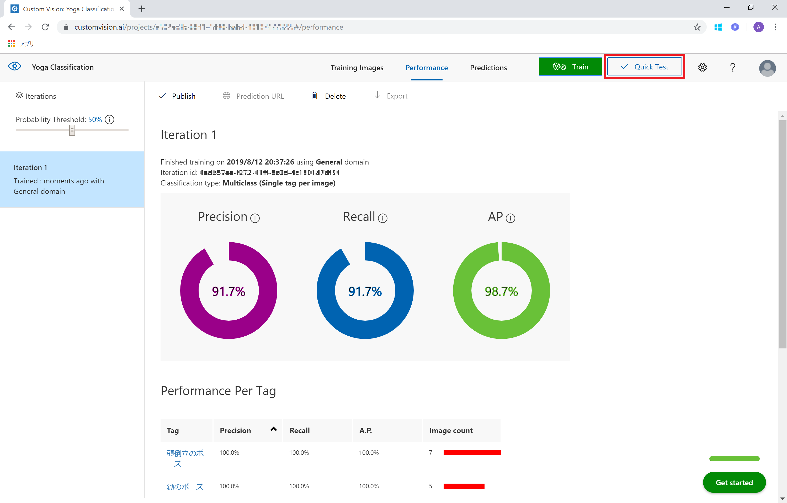

**Browse local files** をクリックして、ダウンロードしたコンテンツの [test_images\Yoga](test_images\Yoga) フォルダーにある画像をひとつ選択します。画像のポーズが正しく識別されたら OK です。

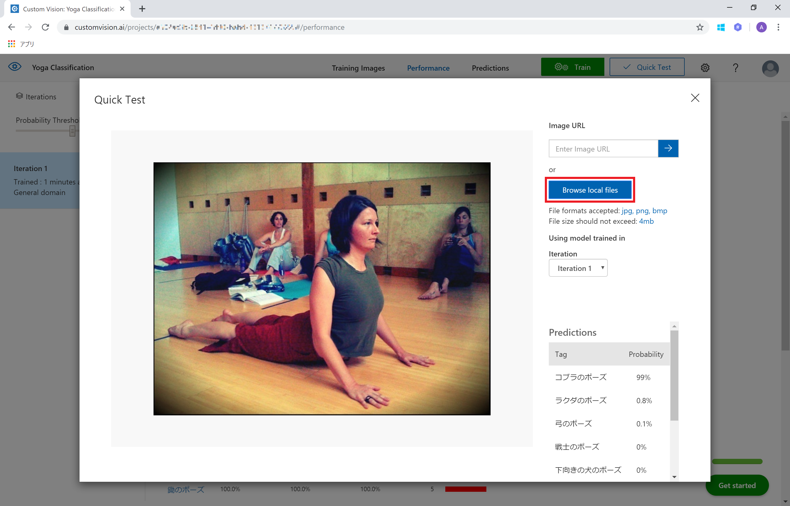

> 必要に応じて、画像の追加→学習→テスト を繰り返します

**Performance** の画面で、上部バーから **Publish** をクリックして、Web API から利用できるように発行を行います。

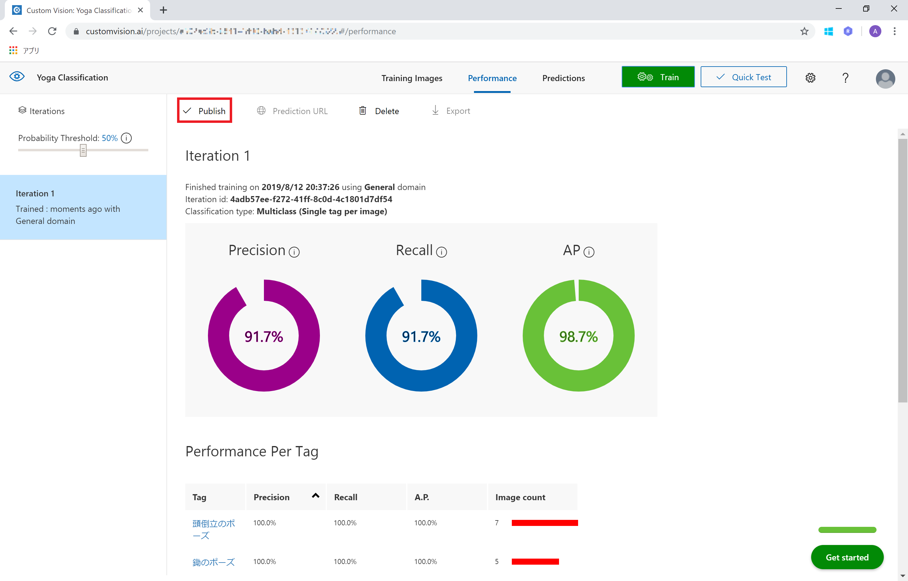

**Publish Name** のダイアログで **Publish** をクリックして発行します。

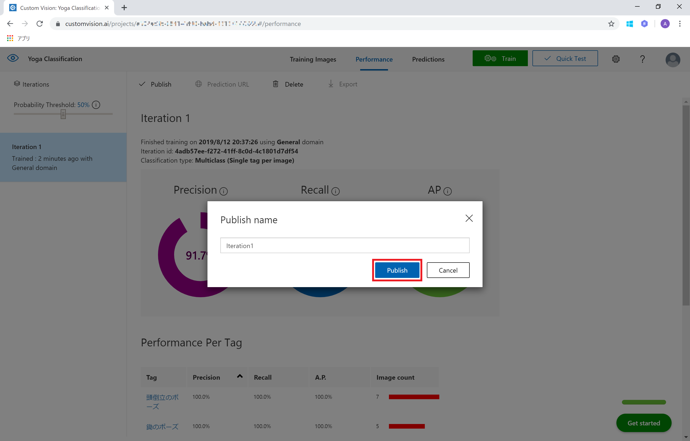

Publish が完了すると **Prediction URL** が表示されるので、クリックして作成した画像判別エンジンにアクセスする URL の情報を表示します。


*If you have an image fIle* の下に表示されている URL と *Prediction-Key* の横に表示されている Prediction Key をコピーして、ローカルに保存しておきます。

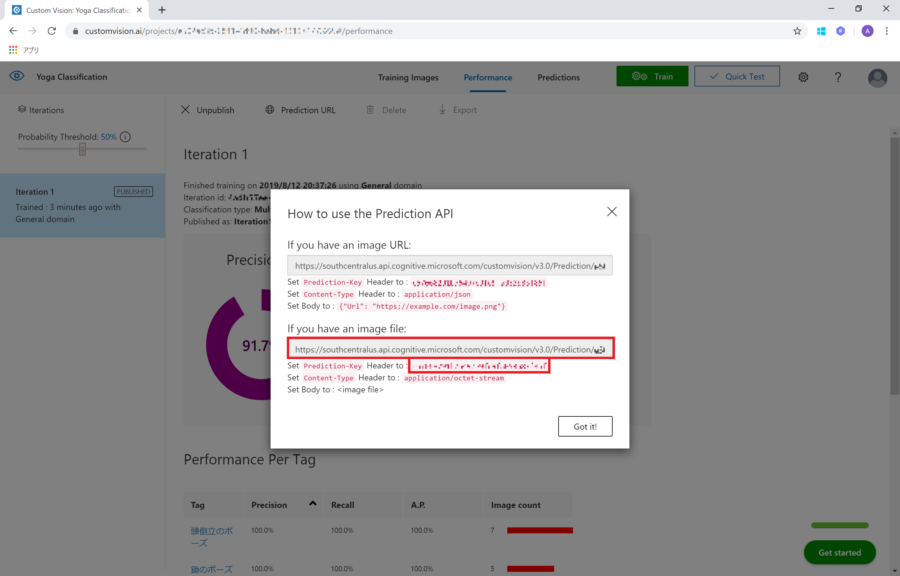


### 2. Web アプリ (HTML&JavaScript) から Custom Vision にアクセス

#### HTML&JavaScript 版

ダウンロードしておいたコンテンツの [samples\JavaScript](samples\JavaScript) フォルダーにあるソースを編集します。

[scripts\customvision_script.js](samples\JavaScript\scripts\customvision_script.js) をコードエディターで開きます。

18,19　行目の predictionKey と endpoint の設定箇所をローカルに保存しておいた URL と Prediction Key で書き換えます。

```
    var predictionKey = "ローカルに保存しておいたPrediction Key";
    var endpoint = "ローカルに保存しておいたURL";
```

customvision_script.js を保存し、 CustomVision.html をブラウザーで開きます。


**[ファイルを選択]** をクリックして、[test_images\Yoga](test_images\Yoga) フォルダーにある画像をひとつ選択します。画像のポーズが識別されて情報が表示されたら完了です。

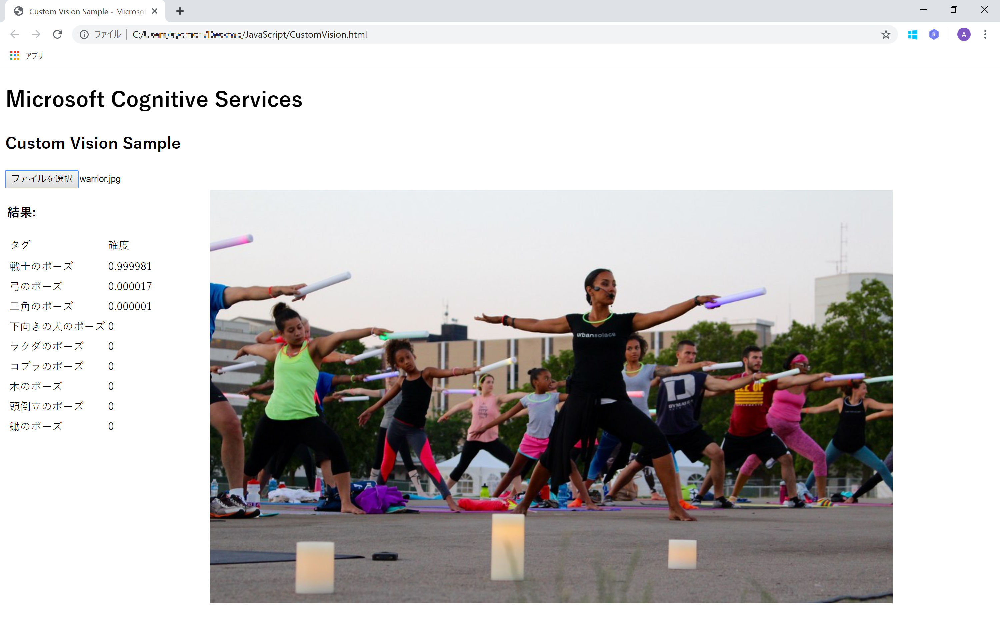


#### C# 版

ダウンロードしておいたコンテンツの [samples\CSharp](samples\CSharp) フォルダーにあるソースを編集します。

[CogServicesVisionSamples_201906.sln](samples\CSharp\CogServicesVisionSamples_201906.sln) を Visual Studio で開きます。

[Pages\CustomVisionClassification.cshtml.cs](samples\CSharp\Pages\CustomVisionClassification.cshtml.cs) をクリックして開きます。

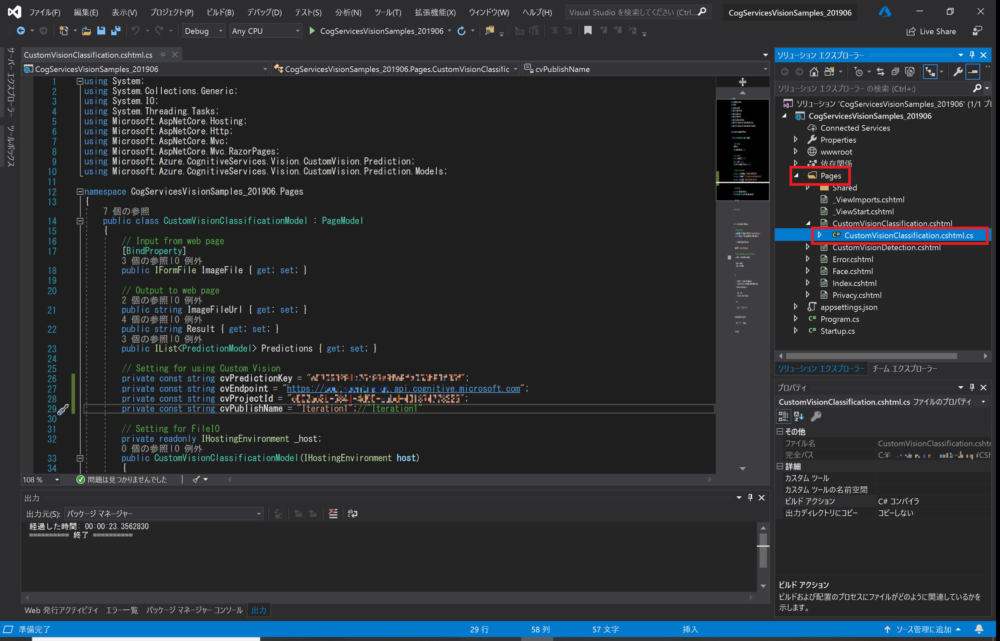

26~29　行目の predictionKey と endpoint の設定箇所をローカルに保存しておいた URL と Prediction Key で書き換えます。

```
    private const string cvPredictionKey = "YOUR_CUSTOMVISION_PREDICTION_KEY";
    private const string cvEndpoint = "https://YOUR_LOCATION.api.cognitive.microsoft.com";
    private const string cvProjectId = "YOUR_CUSTOMVISION_PROJECTID";
    private const string cvPublishName = "YOUR_CUSTOMVISION_PROJECT_PUBLISHNAME";
```

保存しておいた URL が以下のようになっている場合、

<pre>https://southcentralus.api.cognitive.microsoft.com/customvision/v3.0/Prediction/a0000000-0000-0000-aaaa-000000000000/classify/iterations/Iteration1/image </pre>

 - YOUR_LOCATION -> southcentralus
 - YOUR_CUSTOMVISION_PROJECTID -> a0000000-0000-0000-aaaa-000000000000
 - YOUR_CUSTOMVISION_PROJECT_PUBLISHNAME -> Iteration1

となります。

上部バーの ▶ をクリックして、ビルド＆アプリの起動を行います。

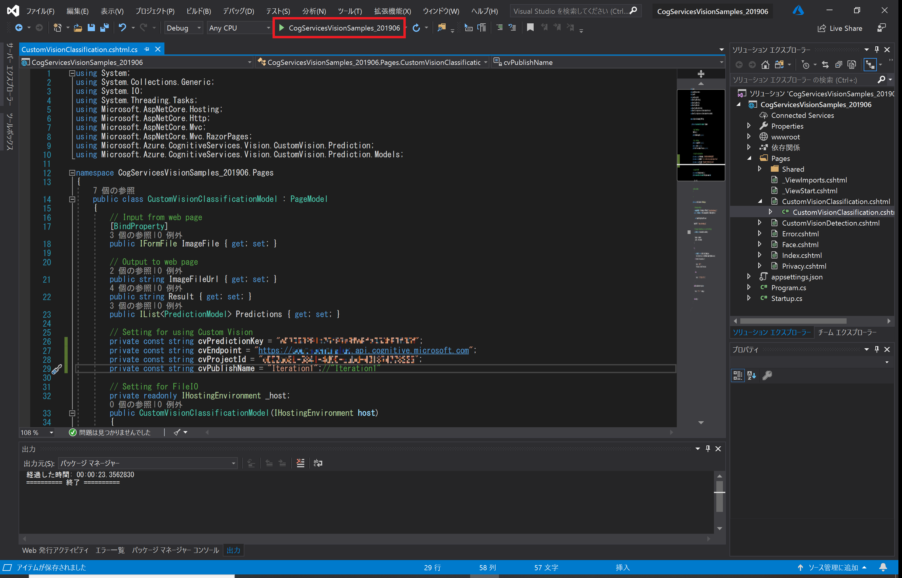

ブラウザーが起動して、Web アプリの画面が表示されます。上部バーから **Custom Vision Classification** をクリックします。

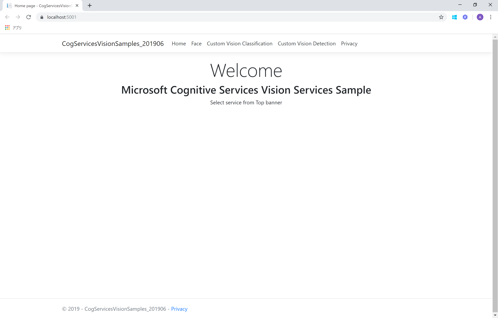

*Custom Vision Classification* の画面で、**[ファイルを選択]** をクリックして、[test_images\Yoga](test_images\Yoga) フォルダーにある画像をひとつ選択します。**[Analyze]** をクリックすると画像のポーズが識別されて情報が表示されたら完了です。

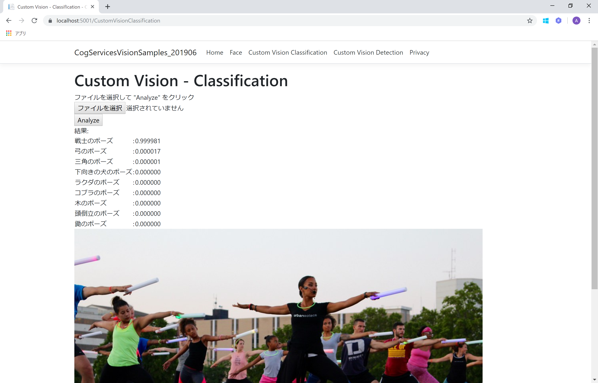
