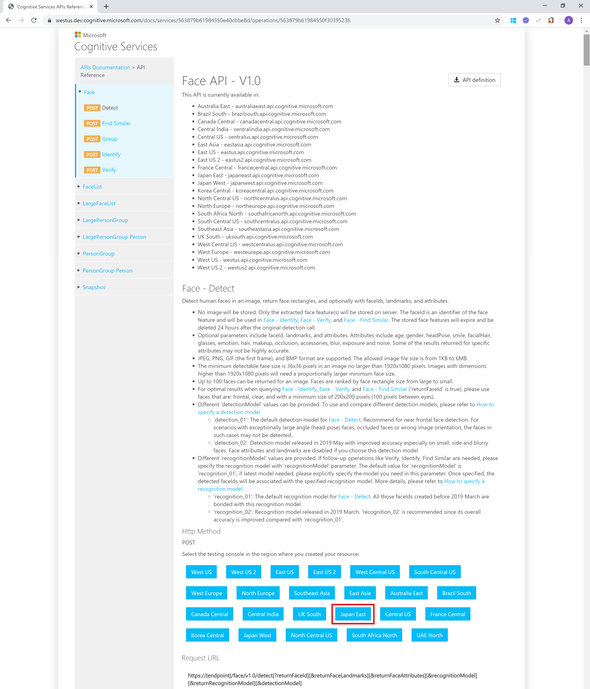
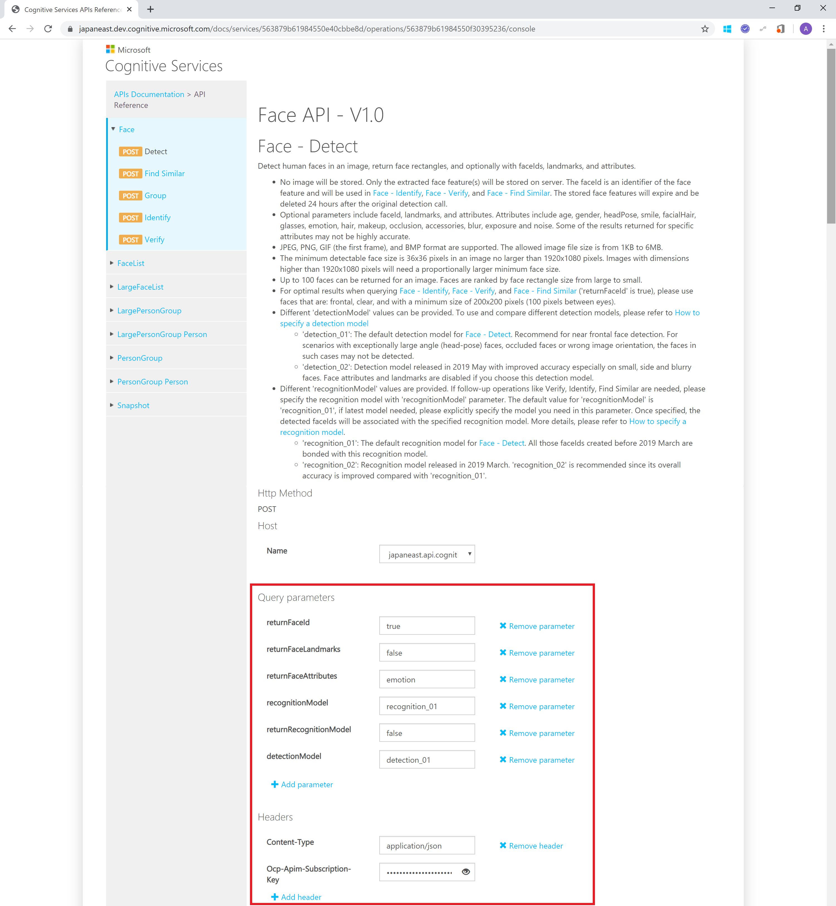
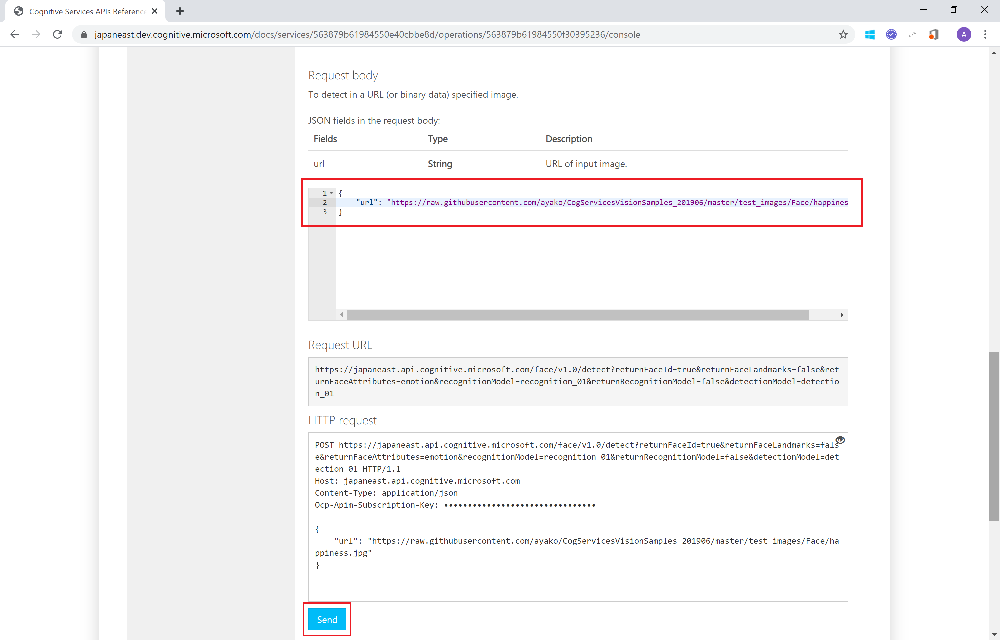
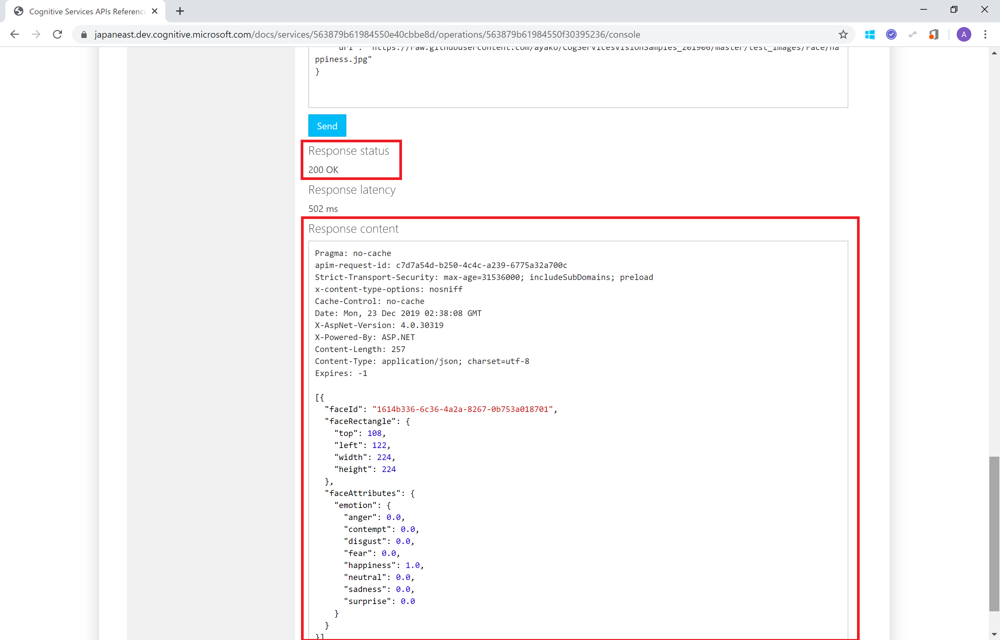
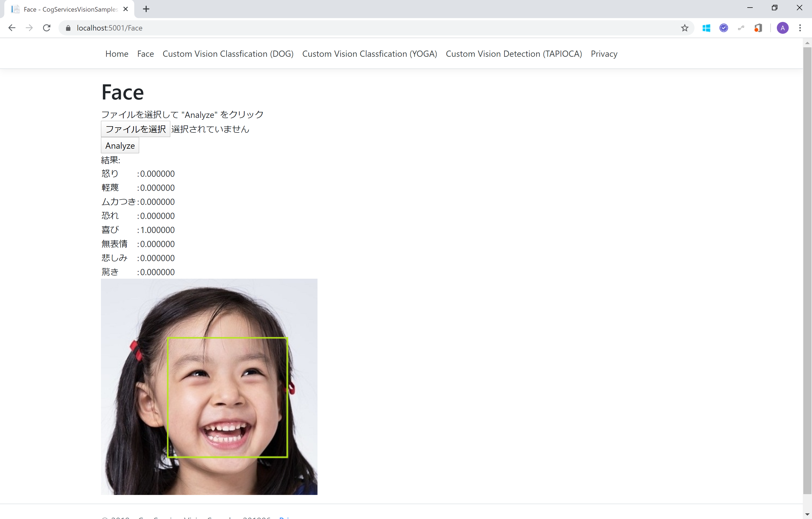

# Microsoft Cognitive Services を利用した 画像識別アプリ 開発 (201912 版: Face API 表情判定)

"人工知能 API" [Microsoft Azure Cognitive Services](https://www.microsoft.com/cognitive-services/) を使うと、画像分析を行うエンジンをノーコーディングで利用、作成できます。

[Face API](https://azure.microsoft.com/ja-jp/services/cognitive-services/face/) は画像から人間の顔を検出する分析するエンジンをすぐに Web API で利用できるサービスです。

ここでは、Face API を Web アプリ (C# または HTML&JavaScript) からアクセスして利用する方法を紹介します。

> アプリの動作は、[オンラインアプリサンプル](http://cogservicesvisionsamples201906.azurewebsites.net/Face) でご確認ください。

## 目次

0. [準備](#準備)
1. [Face API の機能を確認]()
2. Web アプリから Custom Vision にアクセス
    - [HTML&JavaScript 版](#htmljavascript-版)
    - [C# 版](#c-版)


## 準備

- Azure サブスクリプション & Face API のサービス申込
    - Azure サブスクリプション の申し込みには マイクロソフトアカウントが必要です。
    - [Azure 無償サブスクリプション準備](https://qiita.com/annie/items/3c9ddc3fb8f120769239) の手順で、Azure サブスクリプションと Face API のサブスクリプション申込を行います(無償以外の有償アカウント等でも問題ありません)。

- [CogServicesVisionSamples_201906](https://github.com/ayako/CogServicesVisionSamples_201906) のディレクトリをローカルにダウンロードしておきます。**[Clone or download]** をクリックして、ZIP でダウンロードできます。


## 手順

### 1. Face API の機能を確認

Face API の [API リファレンス(Face - Detect)](https://westus.dev.cognitive.microsoft.com/docs/services/563879b61984550e40cbbe8d/operations/563879b61984550f30395236) を開きます。

API リファレンスのページの中頃にリージョンごとの API コンソールへのリンクが表示されます。Face API を作成したリージョン (ここでは Japan East) をクリックします。



**Face - Detect** API コンソール のページ中頃に HTTP Request 設定箇所がありますので、必要事項を入力します。

- Query parameters
  - **returnFaceId** : true(デフォルト値 - 顔認識ID)
  - **returnFaceLandmark** : false(デフォルト値 - 顔のパーツ21カ所の場所取得の有無)
  - **returnFaceAttribute** : **emotion** と入力 (取得したい属性情報)
  - **recognitionModel** : recognition_01(デフォルト値 - 判定するモデル(Microsoft提供 or カスタム))
  - **returnRecognitionModel** : false(デフォルト値)
  - **detectionModel** : detection_01(デフォルト値 - 正面または横顔)
- Headers
  - **Content-Type** : application/json(デフォルト値)
  - **Ocp-Apim-Subscription-Key** : ローカルに保存しておいた Face API の API Key



**Request body** には判定したい画像を指定します。今回はオンライン画像の URL、例えば [test_images\Face](test_images\Face) フォルダーにある画像のURL (https://raw.githubusercontent.com/ayako/CogServicesVisionSamples_201906/master/test_images/Face/happiness.jpg) を利用して、以下のような JSON フォーマットで設定します。

```
{
    "url": "https://raw.githubusercontent.com/ayako/CogServicesVisionSamples_201906/master/test_images/Face/happiness.jpg"
}
```

**[Send]** をクリックすると、Web Request が送信されます。



**Response Status** が 200、Response Content に判定結果が表示されるのを確認してください。




### 2. Web アプリ (HTML&JavaScript) から Face API にアクセス

#### HTML&JavaScript 版

ダウンロードしておいたコンテンツの [samples\JavaScript](samples\JavaScript) フォルダーにあるソースを編集します。

[scripts\faceapi_script.js](samples\JavaScript\scripts\faceapi_script.js) をコードエディターで開きます。

18,19　行目の Subscription Key と URL の設定箇所をローカルに保存しておいた API Key と URL で書き換えます。

```faceapi_script.js
// Face API の Subscription Key と URL をセット
// サブスクリプション画面に表示される URL および Key をコピーしてください
var subscriptionKey = "YOUR_SUBSCRIPTION_KEY";
var endpoint = "https://YOUR_LOCATION.api.cognitive.microsoft.com/face/v1.0";
```

faceapi_script.js を保存し、[FaceAPI.html](samples\JavaScript\FaceAPI.html) をブラウザーで開きます。

**[ファイルを選択]** をクリックして、[test_images\Face](test_images\Face) フォルダーにある画像をひとつ選択します。画像が識別されて、顔の部分に正方形が表示され、表情の情報が表示されたら完了です。


#### C# 版

ダウンロードしておいたコンテンツの [samples\CSharp](samples\CSharp) フォルダーにあるソースを編集します。

[CogServicesVisionSamples_201906.sln](samples\CSharp\CogServicesVisionSamples_201906.sln) を Visual Studio で開きます。

[Pages\Face.cshtml.cs](samples\CSharp\face.cshtml.cs) をクリックして開きます。


26~27　行目の faceSubscriptionKey と faceEndpoint の設定箇所をローカルに保存しておいた API Key と URL で書き換えます。

```Face.cshtml.cs
// Setting for using Face API 
private const string faceSubscriptionKey = "YOUR_SUBSCRIPTION_KEY";
private const string faceEndpoint = "https://YOUR_LOCATION.api.cognitive.microsoft.com";
```

上部バーの ▶ をクリックして、ビルド＆アプリの起動を行います。


ブラウザーが起動して、Web アプリの画面が表示されます。上部バーから **Face** をクリックします。

*Face* の画面で、**[ファイルを選択]** をクリックして、[test_images\Face](test_images\Face) フォルダーにある画像をひとつ選択します。**[Analyze]** をクリックすると画像が識別されて、顔の部分に正方形が表示され、表情の情報が表示されたら完了です。


