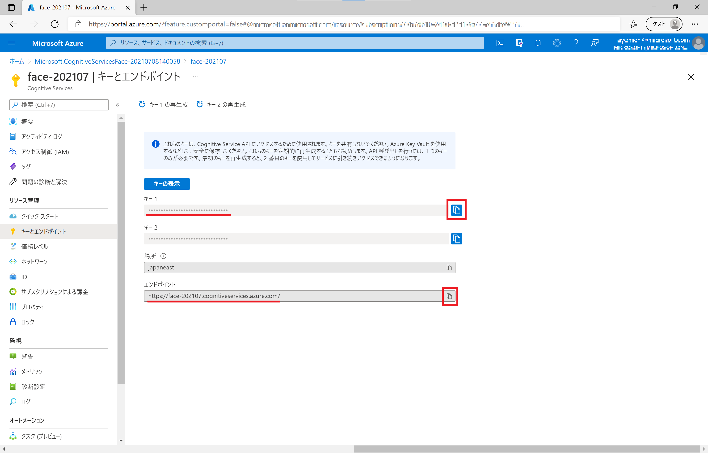
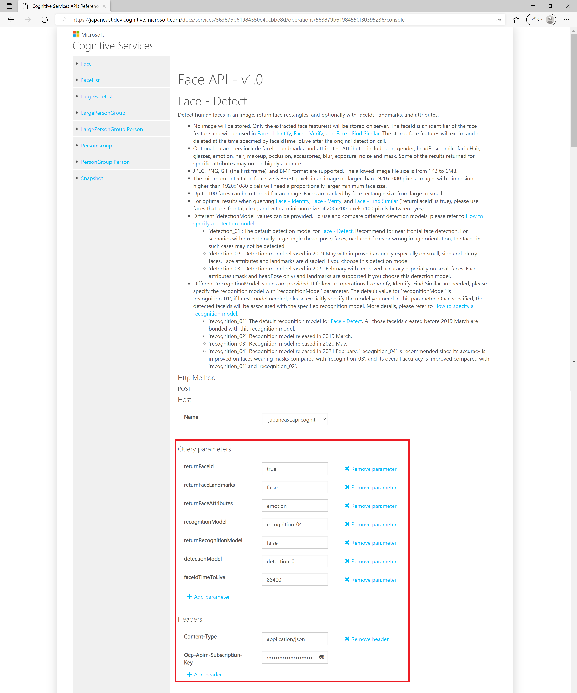
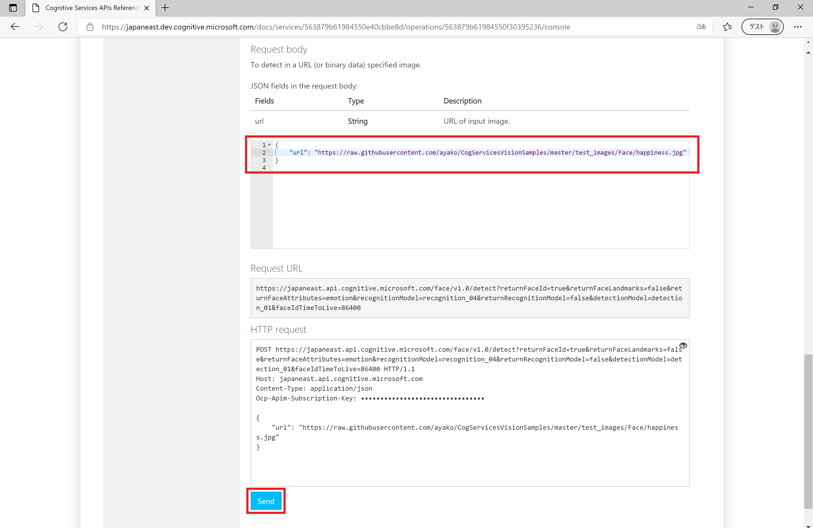
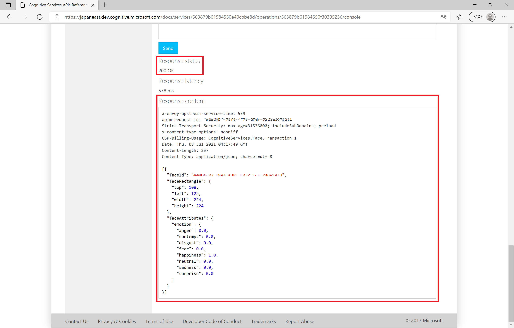
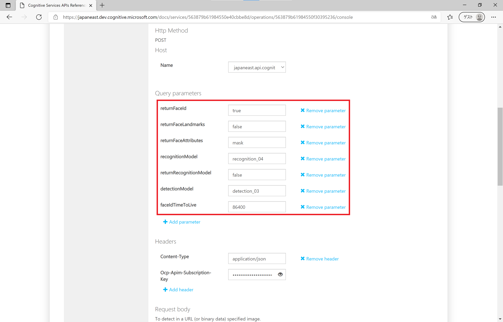
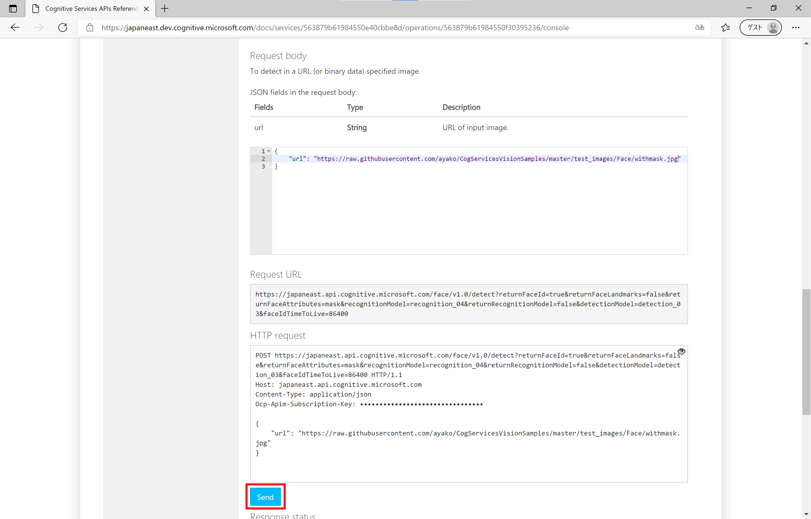
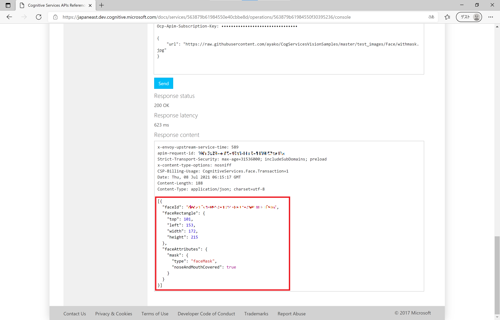

# Microsoft Cognitive Services を利用した 画像識別アプリ 開発 (202107 版: Face API 感情＆マスク判定)

"人工知能 API" [Microsoft Azure Cognitive Services](https://www.microsoft.com/cognitive-services/) や [Microsoft Azure Applied AI Services](https://azure.microsoft.com/ja-jp/product-categories/applied-ai-services/) を使うと、画像分析を行うエンジンをノーコーディングで利用、作成できます。

[Face API](https://azure.microsoft.com/ja-jp/services/cognitive-services/face/) は画像から人間の顔を検出する分析するエンジンをすぐに Web API で利用できるサービスです。

ここでは、Face API を Web アプリ (C# または HTML&JavaScript) からアクセスして、人間の顔画像から感情やマスク着用有無を判定する方法を紹介します。

> アプリの動作は、オンラインアプリサンプル( [感情判定](http://cogservicesvisionsamples201906.azurewebsites.net/Face) | [マスク判定](https://cogservicesvisionsamples202103.azurewebsites.net/MaskRecognition) )でご確認ください。

## 目次

0. [準備](#準備)
1. [Face API の機能を確認](#1-face-api-の機能を確認)
    - 1.1 感情判定
    - 1.2 マスク判定
2. Web アプリから Face API にアクセス
    - [HTML&JavaScript 版](#htmljavascript-版)
    - [C# 版](#c-版)


## 準備

- Azure サブスクリプション & Face API のサービス申込
    - Azure サブスクリプション の申し込みには マイクロソフトアカウントが必要です。
    - [Azure 無償サブスクリプション準備](https://qiita.com/annie/items/3c9ddc3fb8f120769239) の手順で、Azure サブスクリプション申込を行います(無償以外の有償アカウント等でも問題ありません)。
    - [Cognitive Services サブスクリプション準備]() の手順で、Face API のサービス作成を行います。
      - Face API のエンドポイント(Rest API アクセス URL)と、アクセスキー をローカルに保存しておきます。



- [CogServicesVisionSamples](https://github.com/ayako/CogServicesVisionSamples) のディレクトリをローカルにダウンロードしておきます。**[Clone or download]** をクリックして、ZIP でダウンロードできます。


## 手順

### 1. Face API の機能を確認

Face API の [API リファレンス(Face - Detect)](https://westus.dev.cognitive.microsoft.com/docs/services/563879b61984550e40cbbe8d/operations/563879b61984550f30395236) を開きます。

API リファレンスのページの中頃にリージョンごとの API コンソールへのリンクが表示されます。Face API を作成したリージョン (ここでは Japan East) をクリックします。


#### 1.1 Face API による感情判定

**Face - Detect** API コンソール のページ中頃に HTTP Request 設定箇所がありますので、必要事項を入力します。

- Query parameters
  - **returnFaceId** : true(デフォルト値 - 顔認識ID)
  - **returnFaceLandmark** : false(デフォルト値 - 顔のパーツ21カ所の場所取得の有無)
  - **returnFaceAttribute** : **emotion** と入力 (取得したい属性情報)
  - **recognitionModel** : recognition_04(デフォルト値 - 判定するモデル(Microsoft提供 or カスタム))
  - **returnRecognitionModel** : false(デフォルト値)
  - **detectionModel** : **detection_01** を選択 (正面または横顔)
  - **faceIdTimeToLive** : 86400(デフォルト値 - データ保持期間)
- Headers
  - **Content-Type** : application/json(デフォルト値)
  - **Ocp-Apim-Subscription-Key** : ローカルに保存しておいた Face API の API Key



**Request body** には判定したい画像を指定します。今回はオンライン画像の URL、例えば [test_images\Face](test_images/Face) フォルダーにある画像のURL (https://raw.githubusercontent.com/ayako/CogServicesVisionSamples/master/test_images/Face/happiness.jpg) を利用して、以下のような JSON フォーマットで設定します。

```
{
    "url": "https://raw.githubusercontent.com/ayako/CogServicesVisionSamples/master/test_images/Face/happiness.jpg"
}
```

**[Send]** をクリックすると、Web Request が送信されます。



**Response Status** が 200、Response Content に判定結果が表示されるのを確認してください。顔の位置 (faceRectangle) や 感情 (faceAttributes - emotion) が 8 つのスコア (anger, contenpt, disgust, fear, happiness, neutral, sadness, surprise) で表示されることが分かります。




#### 1.2 Face API によるマスク判定

今度は マスク着用判定を行います。**Face - Detect** API コンソール のページ中頃に HTTP Request 設定を以下のように変更します。

- Query parameters
  - **returnFaceId** : true(デフォルト値 - 顔認識ID)
  - **returnFaceLandmark** : false(デフォルト値 - 顔のパーツ21カ所の場所取得の有無)
  - **returnFaceAttribute** : **mask** と入力 (取得したい属性情報)
  - **recognitionModel** : recognition_04(デフォルト値)
  - **returnRecognitionModel** : false(デフォルト値)
  - **detectionModel** : **detection_03** を選択
  - **faceIdTimeToLive** : 86400(デフォルト値 - データ保持期間)
- Headers
  - **Content-Type** : application/json(変更なし) 
  - **Ocp-Apim-Subscription-Key** : ローカルに保存しておいた Face API の API Key(変更なし)



**Request body** には判定したい画像を指定します。今回はオンライン画像の URL、例えば [test_images\Face](test_images/Face) フォルダーにある画像のURL (https://raw.githubusercontent.com/ayako/CogServicesVisionSamples/master/test_images/Face/withmask.jpg) を利用して、以下のような JSON フォーマットで設定します。

```
{
    "url": "https://raw.githubusercontent.com/ayako/CogServicesVisionSamples/master/test_images/Face/withmask.jpg"
}
```

**[Send]** をクリックすると、Web Request が送信されます。



**Response Status** が 200、Response Content に判定結果が表示されるのを確認してください。今度はマスク着用(faceAttributes - mask) がマスクの種類 (type) と、鼻と口を覆っているか (noseAndMouthCovered) で表示されることを確認してください。




### 2. Web アプリ (HTML&JavaScript) から Face API にアクセス

#### HTML&JavaScript 版

ダウンロードしておいたコンテンツの [samples\JavaScript](samples/JavaScript) フォルダーにあるソースを編集します。

[scripts\faceapi_script.js](samples/JavaScript/scripts/faceapi_script.js) をコードエディターで開きます。

18,19　行目の Subscription Key と URL の設定箇所をローカルに保存しておいた API Key と URL で書き換えます。

```faceapi_script.js
// Face API の Subscription Key と URL をセット
// サブスクリプション画面に表示される URL および Key をコピーしてください
var subscriptionKey = "YOUR_SUBSCRIPTION_KEY";
var endpoint = "https://YOUR_LOCATION.api.cognitive.microsoft.com/face/v1.0";
```

faceapi_script.js を保存し、[FaceAPI.html](samples/JavaScript/FaceAPI.html) をブラウザーで開きます。

**[ファイルを選択]** をクリックして、[test_images\Face](test_images/Face) フォルダーにある画像をひとつ選択します。画像が識別されて、顔の部分に正方形が表示され、表情の情報が表示されたら完了です。


#### C# 版

ダウンロードしておいたコンテンツの [samples\CSharp](samples/CSharp) フォルダーにあるソースを編集します。

[CogServicesVisionSamples_201906.sln](samples/CSharp/CogServicesVisionSamples_201906/CogServicesVisionSamples_201906.sln) を Visual Studio で開きます。

[Pages\Face.cshtml.cs](samples/CSharp/CogServicesVisionSamples_201906/Pages/Face.cshtml.cs) をクリックして開きます。


26~27　行目の faceSubscriptionKey と faceEndpoint の設定箇所をローカルに保存しておいた API Key と URL で書き換えます。

```Face.cshtml.cs
// Setting for using Face API 
private const string faceSubscriptionKey = "YOUR_SUBSCRIPTION_KEY";
private const string faceEndpoint = "https://YOUR_LOCATION.api.cognitive.microsoft.com";
```

上部バーの ▶ をクリックして、ビルド＆アプリの起動を行います。


ブラウザーが起動して、Web アプリの画面が表示されます。上部バーから **Face** をクリックします。

*Face* の画面で、**[ファイルを選択]** をクリックして、[test_images\Face](test_images/Face) フォルダーにある画像をひとつ選択します。**[Analyze]** をクリックすると画像が識別されて、顔の部分に正方形が表示され、表情の情報が表示されたら完了です。


