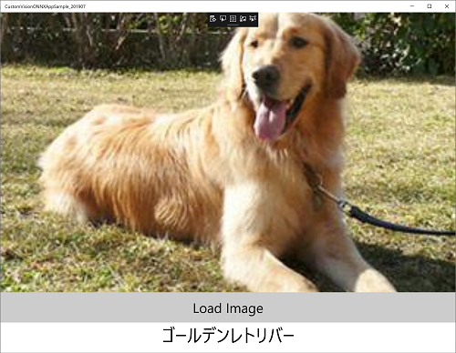
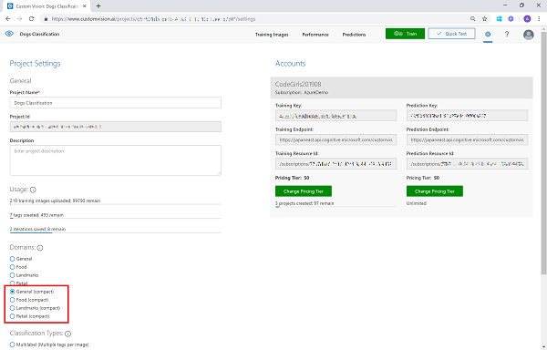
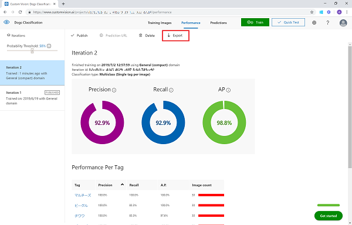
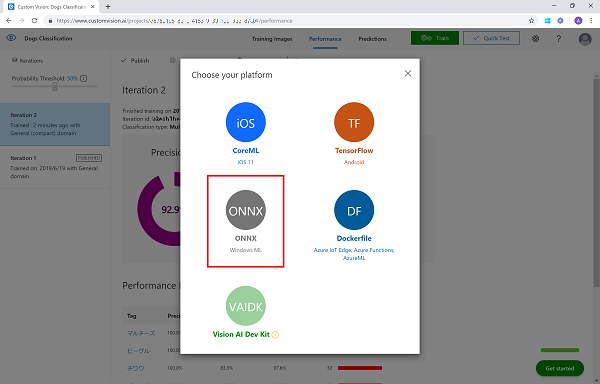
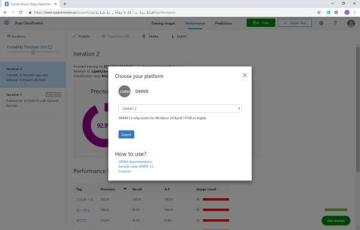

# Microsoft Cognitive Services を利用した 画像分析アプリ (201906 版)

"人工知能 API" [Microsoft Azure Cognitive Services](https://www.microsoft.com/cognitive-services/) を使うと、画像分析を行うエンジンをノーコーディングで利用、作成できます。

- [Face API](https://azure.microsoft.com/ja-jp/services/cognitive-services/face/) は画像から人間の顔を検出し、分析するエンジンがすぐに Web API で利用できます。
- [Custom Vision Service](https://azure.microsoft.com/ja-jp/services/cognitive-services/custom-vision-service/) は、ご自分で用意した画像をアップロードしてタグ付け、学習させることで、画像の分類 (Classification) や 画像に写っているモノの抽出 (Object Detection) を行うエンジンを簡単に作成でき、Web API として利用できます。また TensorFlow / CoreML / ONNX、または Docker コンテナー向けに Export して利用することもできます。

# サンプルの動作確認

- [Face API](http://cogservicesvisionsamples201906.azurewebsites.net/Face)
- [Custom Vision](http://cogservicesvisionsamples201906.azurewebsites.net/CustomVisionClassification-Dog)


# サンプルの利用方法

- Face API ([C#](#c) | [HTML/JavaScript](#htmljavascript))
- Custom Vision ([C#](#c-1) | [HTML/JavaScript](#htmljavascript-1))
- Custom Vision (model export) ([ONNX & UWP(C#)](#onnx--uwp))

## Face API

Face API の エンドポイント(URL) と キー (Subscription Key) にご自分のサブスクリプションの情報を入力します。


### C#

[Face.cshtml.cs](samples/CSharp/Pages/Face.cshtml.cs)

```Face.cshtml.cs
// Setting for using Face API 
private const string faceSubscriptionKey = "YOUR_SUBSCRIPTION_KEY";
private const string faceEndpoint = "https://YOUR_LOCATION.api.cognitive.microsoft.com";
```

Visual Studio プロジェクトを開き、NuGet パッケージの復元を行います。ビルド＆起動して、localhost:<YOUR_PORT>/Face にアクセスし、画像をアップロードして動作を確認できます。

### HTML/JavaScript

[faceapi_script.js](samples/JavaScript/scripts/faceapi_script.js)

```faceapi_script.js
// Face API の Subscription Key と URL をセット
// サブスクリプション画面に表示される URL および Key をコピーしてください
var subscriptionKey = "YOUR_SUBSCRIPTION_KEY";
var endpoint = "https://YOUR_LOCATION.api.cognitive.microsoft.com/face/v1.0";
```

FaceAPI.html を開き、画像をアップロードして動作を確認できます。

## Custom Vision

Custom Vision のエンドポイント(URL) と キー (Prediction Key) にご自分のサブスクリプション および 作成した Custom Vision App の情報を入力します。

### C#


[CustomVisionClassification.cshtml.cs](samples/CSharp/Pages/CustomVisionClassicifation.cshtml.cs) </br>
[CustomVisionDetection.cshtml.cs](samples/CSharp/Pages/CustomVisionDetection.cshtml.cs)

```CustomVisionClassification.cshtml.cs, CustomVisionDetection.cshtml.cs
// Setting for using Custom Vision 
private const string cvPredictionKey = "YOUR_CUSTOMVISION_PREDICTION_KEY";
private const string cvEndpoint = "https://YOUR_LOCATION.api.cognitive.microsoft.com";
private const string cvProjectId = "YOUR_CUSTOMVISION_PROJECTID";
private const string cvPublishName = "YOUR_CUSTOMVISION_PROJECT_PUBLISHNAME";//"Iteration1"
```

Visual Studio プロジェクトを開き、NuGet パッケージの復元を行います。ビルド＆起動して、localhost:<YOUR_PORT>/CustomVisionClassiication または CustomVisionDetection にアクセスし、画像をアップロードして動作を確認できます。


### HTML/JavaScript


[customvision_script.js](samples/JavaScript/scripts/customvision_script.js)

```customvision_script.js
// Custom Vision の Subscription Key と URL をセット
// サブスクリプション画面に表示される URL および Key をコピーしてください
var predictionKey = "YOUR_PREDICTION_KEY";
var endpoint = "https://YOUR_LOCATION.api.cognitive.microsoft.com/customvision/v3.0/Prediction/YOUR_APP_ID/classify/iterations/YOUR_APP_ITERATION/image";
```

CustomVision.html を開き、画像をアップロードして動作を確認できます。

## Custom Vision (Model Export)

### ONNX & UWP

動作確認環境: Windows 10 (Build 18362.175), Windows SDK 10.0.17763, Visual Studio 2019 (v16.1)

一式をローカルに保存して、Visual Studio で開き、ビルドを行います。(必要なライブラリーが読み込まれます)
デフォルトで ONNX モデルが含まれていますので、[テスト画像](test_images/Dog) をロードして動作を確認できます。




#### 自分で Custom Vision から作成したモデルを利用する方法

Custom Vision Portal で **Compact** タイプのプロジェクトを作成します。(既存のプロジェクトを Compact に変更するには、設定画面から "Compact" に変更して再学習させます。)



ONNX (v1.2) でモデルを Export し、ダウロードします。





ダウンロードした ONNX モデルを **CustomVision.onnx** に名前を変更し、[Assets](samples/ONNX/Assets) フォルダーにある CustomVision.onnx と入れ替えます。

再度ビルド＆デバック実行を行い、動作を確認してください。
